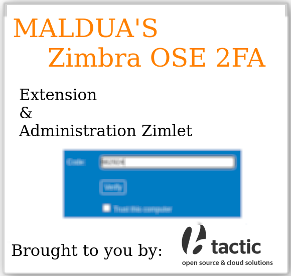
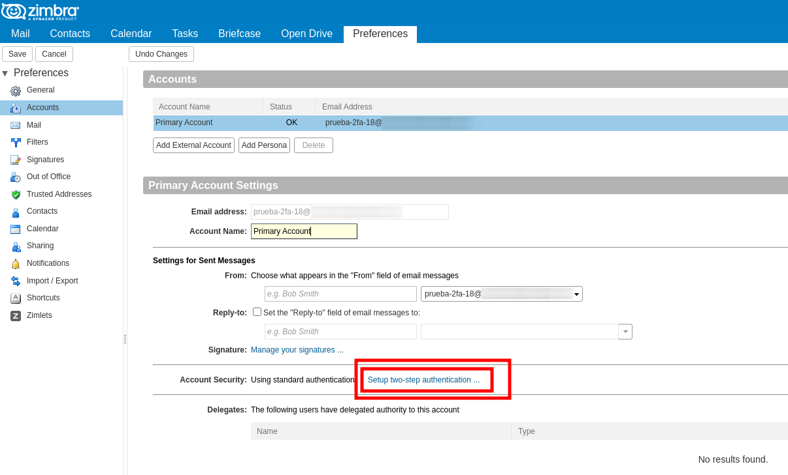
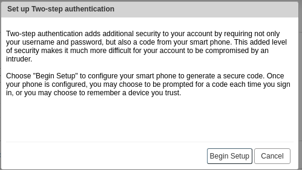
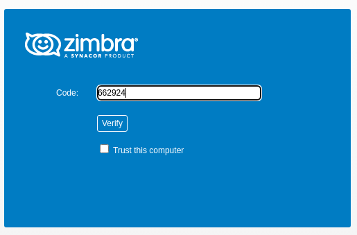
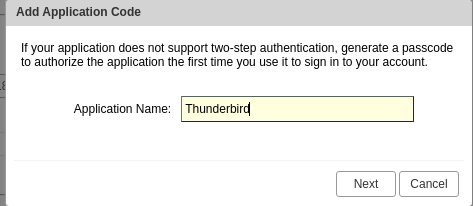
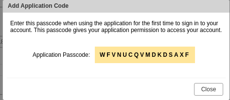
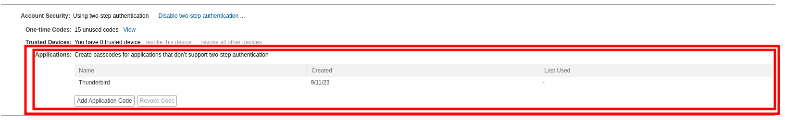
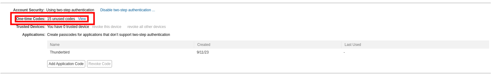
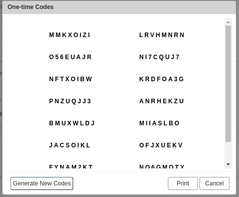
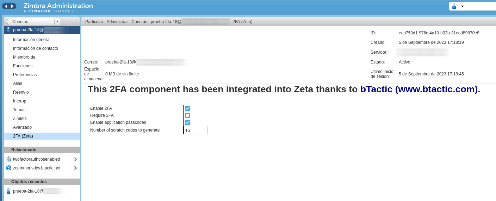

# Zimbra OSE 2FA

**Warning: THIS PROJECT SHOULD BE CONSIDERED AS BETA QUALITY.**



## About

**ZETA'S Zimbra OSE 2FA Extension & Administration Zimlet** brought to you by [BTACTIC, open source & cloud solutions](https://www.btactic.com).

This project aims to build an Open Source replacement of:

- Zimbra Network Edition 2FA Extension
- Zimbra Network Edition 2FA Administration zimlet.

For the final user UI it relies on current Zimbra OSE support for 2FA integrated on the Webmail.

## Features

### Integrated with Zimbra Webclient UI

Seamless integrated with native Zimbra Webclient UI for 2FA.





### Basic 2FA

An additional authentication factor based on TOTP (Time-based One-Time Passwords). This is compatible with Google Authenticator or Authy.



### Trusted devices

Mark your usual device as trusted so that you are not asked for 2FA each time you login.

### Application specific passwords

Do you have **Imap** or pop3 applications that do not support 2FA?
Keep using them with an specific password for each one of them.





### Scratch codes

Scratch or one-time use codes are generated so that you can write them down in a paper just in case your 2FA application no longer works for you.




### Network Edition binary compatibility upgrade

Both *Zimbra OSE 2FA* and current *Zimbra Network Edition* share a design based on a public codebase from around 2016.

Take a look at this scenario:

- ZCS OSE 8.8.15 - **Standard ZCS OSE 8.8.15**
- ZCS OSE 8.8.15 + zimbra-ose-2fa - **zimbra-ose-2fa is installed**
- Enable/**Use 2FA** features in different Classes of Services or accounts.
- ZCS OSE 8.8.15 - **Uninstall zimbra-ose-2fa**
- ZCS NE 8.8.15 - **Upgrade from ZCS OSE to ZCS NE**

Once you have upgraded to ZCS NE 8.8.15 all of the 2FA features that were enabled/used in **ZCS OSE 8.8.15 + zimbra-ose-2fa** setup should keep working. No need to reissue 2FA codes and ask final users to update their Google Authenticator, Authy or specific Thunderbird/Imap client password.

## Admin documentation

### Management

When creating or editing a class of service or an account there is an additional tab named **2FA (Zeta)** where you can:

- Enable or disable 2FA feature
- Check if the account requires 2FA for login
- Enable or disable application specific passwords or passcodes
- Setup the numer of scratch codes to generate



### Installation

In a Multi-Server cluster these commands have to be run on each one of the mailbox nodes.

**Requisites:**

- unzip

```
apt install unzip
```

**WARNING:** Please change **0.1.0** with whatever it's the latest released version.

```
sudo -i # Become root
cd /tmp
wget 'https://github.com/btactic/zimbra-ose-2fa/releases/download/v0.1.0/zimbra-ose-2fa_0.1.0.zip'
unzip zimbra-ose-2fa_0.1.0.zip
cd zimbra-ose-2fa_0.1.0
cp zetatwofactorauth.jar /opt/zimbra/lib/ext/twofactorauth/zetatwofactorauth.jar
chown zimbra:zimbra com_btactic_twofactorauth_admin.zip
su - zimbra -c 'zmzimletctl -l deploy ./com_btactic_twofactorauth_admin.zip'
```

In order for the two-factor authentication extension and the adminZimlet to apply you need to restart mailboxd with:
```
sudo -i # Become root
su - zimbra -c 'zmmailboxdctl restart'
```

## Developer documentation

This documentation is aimed at developers, not at admins.

### How to build the extension

- Check: [EXTENSION_BUILD.md](EXTENSION_BUILD.md) on how to build the Extension.

### How to install the extension

- Check: [EXTENSION_INSTALL.md](EXTENSION_INSTALL.md) on how to install the Extension.

### How to build the admin zimlet

- Check: [ADMINZIMLET_BUILD.md](ADMINZIMLET_BUILD.md) on how to build the Administration Console Zimlet.

### How to install the admin zimlet

- Check: [ADMINZIMLET_INSTALL.md](ADMINZIMLET_INSTALL.md) on how to install the Administration Console Zimlet.

### How to release the extension and admin zimlet

- Check: [RELEASE.md](RELEASE.md) on how to release the extension and admin zimlet.

## Some background

This is some background for those of you that enjoy reading developer stories.

At the [Zimbra Roadmap and Product Update from February, 2015](https://cdn2.hubspot.net/hub/212115/file-2452880015-pdf/pdf_files/2015_Roadmap_Update_-_Feb_2015_FINAL.pdf) you can read about how for ZCS 8.7 there was a Mobile Gateway section that mentioned: *Zimbra Mobile Gateway + Push Notifications + 2-Factor Security*.

This was actually ZCS 8.6 being improved for having such features.

Development versions of ZCS OSE 8.6 had an initial implementation of 2FA but, then, someone at Zimbra, decided that it was worth it moving it to the NE version as an extension (2FA was not going to be available at OSE version!). More over the 2FA webclient support will be refactored in such a way so that alternative 2FA implementations could be written by other developers or companies.

You can take a look at commits from those days:

- [zm-mailbox-zmg-2fa's zmg-2fa-last-snapshot](https://github.com/adriangibanelbtactic/zm-mailbox-zmg-2fa/tree/zmg-2fa-last-snapshot)
- [zm-mailbox-zmg-2fa's zmg-2fa-last-soap-snapshot](https://github.com/adriangibanelbtactic/zm-mailbox-zmg-2fa/tree/zmg-2fa-last-soap-snapshot)
- [zm-mailbox-zmg-2fa' zmg-2fa-move-to-ne-snapshot](https://github.com/adriangibanelbtactic/zm-mailbox-zmg-2fa/tree/zmg-2fa-move-to-ne-snapshot)

So... this extension is an affirmative answer to this question...

**Is it possible to rewrite the old 8.6 code for 2FA so that it can be ported into its own extension?**

## Licenses

### License (Extension)

```
Zimbra OSE 2FA Extension
Copyright (C) 2023 BTACTIC, S.C.C.L.

Zimbra Collaboration Suite Server
Copyright (C) 2007, 2008, 2009, 2010, 2013, 2014 Zimbra, Inc.

This program is free software: you can redistribute it and/or modify it under
the terms of the GNU General Public License as published by the Free Software Foundation,
version 2 of the License.

This program is distributed in the hope that it will be useful, but WITHOUT ANY WARRANTY;
without even the implied warranty of MERCHANTABILITY or FITNESS FOR A PARTICULAR PURPOSE.
See the GNU General Public License for more details.
You should have received a copy of the GNU General Public License along with this program.
If not, see <http://www.gnu.org/licenses/>.
```

### License (Administration zimlet)

```
Zimbra OSE 2FA Administration zimlet
Copyright (C) 2023 BTACTIC, S.C.C.L.

This program is free software: you can redistribute it and/or modify
it under the terms of the GNU General Public License as published by
the Free Software Foundation, either version 2 of the License, or
(at your option) any later version.

This program is distributed in the hope that it will be useful,
but WITHOUT ANY WARRANTY; without even the implied warranty of
MERCHANTABILITY or FITNESS FOR A PARTICULAR PURPOSE.  See the
GNU General Public License for more details.

You should have received a copy of the GNU General Public License
along with this program.  If not, see http://www.gnu.org/licenses/.
```
